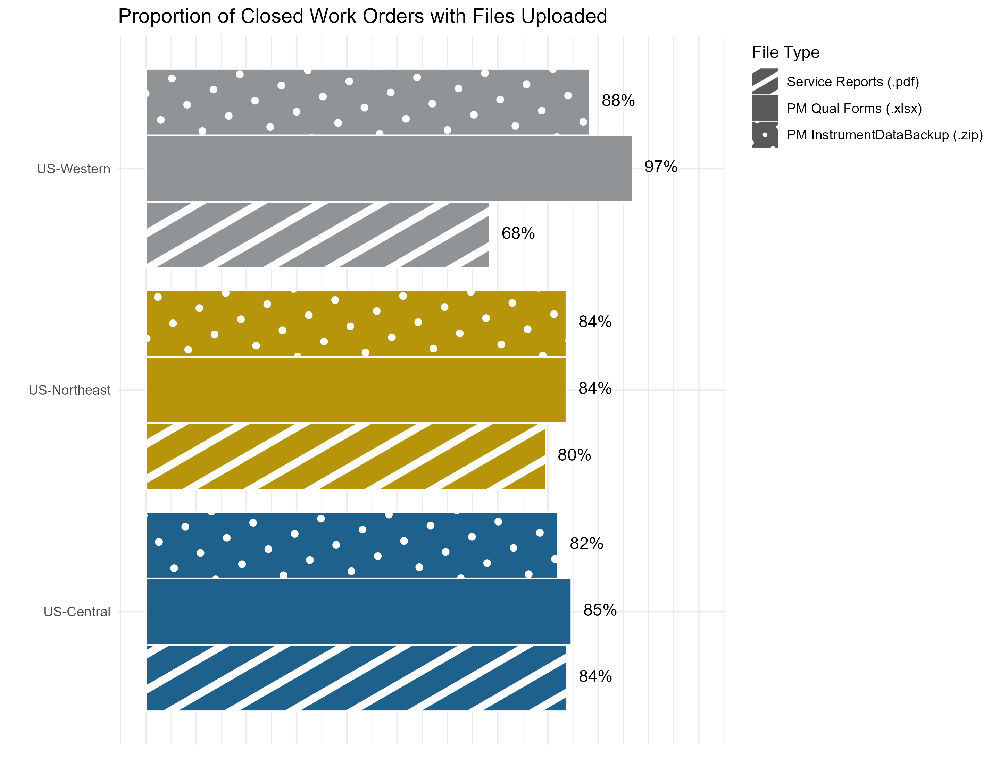

# salesforce_file_upload_reporting
A way to track if field service engineers are uploading the appropriate documents to Work Orders.

Salesforce is queried to analyze file uploads which are then filtered for specific work order types.  In this particular script, the following scenarios are charted:

* Preventive Maintenance Work Orders require the following file types
  * .xlsx qualification form
  * .zip data backup
  
* All standard Work Orders with typical onsite visit
  * .pdf service report
  
File extensions are obviously filtered, however, an additional effort is examined to parse the filename.  For example, if multiple .pdf files are uploaded to the work order, the most recent .pdf with 'ServiceReport' is isolated as the most likely file.  If a .pdf doesn't exist with 'ServiceReport' in the name, then the most recent .pdf is returned.  If no file exists, it is recorded as NA.  The following charts provide examples as to how a field service region can track/manage operational expectations.

Toggle the 'query_sfdc' boolean variable to either:

* True:  query Salesforce for the most recent data
* False: read from a locally saved .csv that was exported during the last Salesforce query

